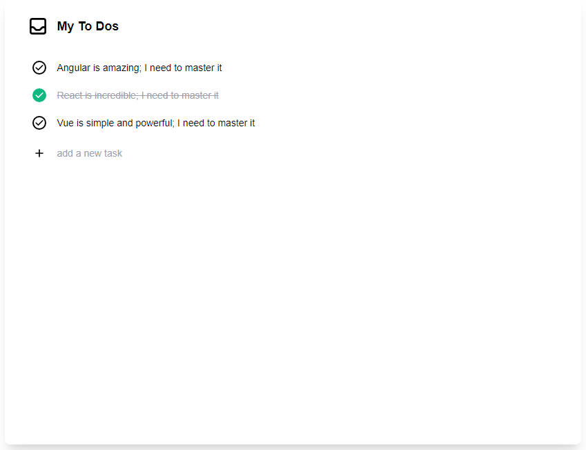
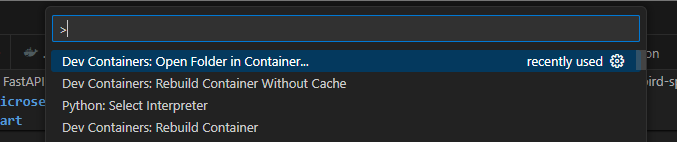
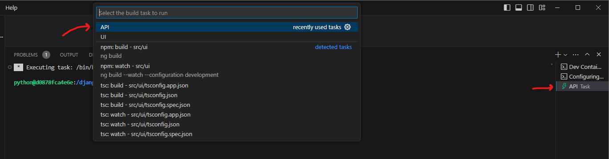
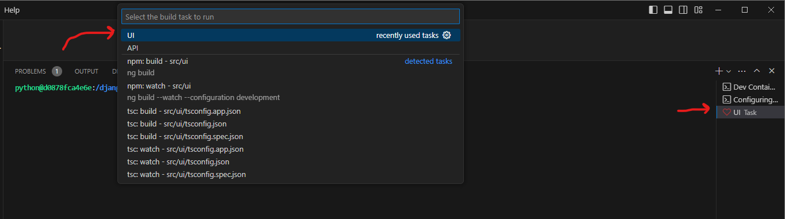

# To-do App with Django, Django Rest Framework, Angular, TypeScript, Tailwind, OpenAPI Generator, and NgRx



This is a simple to do application demonstrating use of the following technologies:

- Django
- Django REST Framework
- DRF Spectacular
- Angular
- TypeScript
- Tailwind
- OpenAPI Generator
- NgRx

## Getting Started

### 1. Clone Repo

```bash
git clone https://github.com/joshjhans/django-angular-to-do-app.git
```

### 2. Attach VS Code to cloned `django-angular-to-do-app` directory

Open the `django-angular-to-do-app` directory with VS Code.

### 3. Open `django-angular-to-do-app` directory in a container



Note that the `Dockerfile` will install the necessary Python, Node, and Java dependencies as part of the Docker image.

### 4. Backend API

The backend is located in the `./src/api` directory. It utilizes Django, Django Rest Framework, and more to serve a REST API for the to-do app.

For security, ensure you update `SECRET_KEY` and `ALLOWED_HOSTS` in `./src/api/api/settings.py`:

```python
# SECURITY WARNING: keep the secret key used in production secret!
SECRET_KEY = "django-insecure"

ALLOWED_HOSTS = ["*"]
```

Press <kbd>Ctrl</kbd> + <kbd>Shift</kbd> + <kbd>B</kbd> to open a pre-configured terminal in the `./src/api` directory.



Next, ensure to migrate the Django and to-do app models to the local SQLite database by executing the following command in the `API` terminal (`./src/api`):

```bash
python manage.py migrate
```

Then, run the Django REST API with the following command:

```bash
python manage.py runserver
```

The REST API is not running at [http://127.0.0.1:8000/](http://127.0.0.1:8000/):

```bash
python@d0878fca4e6e:/django-angular-to-do-app/src/api$ python manage.py runserver
Watching for file changes with StatReloader
Performing system checks...

System check identified no issues (0 silenced).
March 11, 2024 - 15:45:59
Django version 5.0.3, using settings 'api.settings'
Starting development server at http://127.0.0.1:8000/
Quit the server with CONTROL-C.
```

### 5. Frontend UI

The frontend is located in the `./src/ui` directory. It utilizes Angular, TypeScript, Tailwind, OpenAPI Generator, NgRx and more to provide a simple user interface for the to-do application.

Press <kbd>Ctrl</kbd> + <kbd>Shift</kbd> + <kbd>B</kbd> to open a pre-configured terminal in the `./src/ui` directory.



To start the frontend Angular application, execute the following command in the UI terminal (`./src/ui`):

```bash
ng serve --open
```

The above command will open [http://localhost:4200/](http://localhost:4200/) in a browser.

### 6. Generating TypeScript Fetch Client with OpenAPI Generator

The [`openapi-generator`](https://github.com/OpenAPITools/openapi-generator) project provides a means to generate REST API clients from an OpenAPI specification like that provided by DRF Spectacular. To re-generate the to-do app TypeScript client in the `./src/ui/src/app/clients` directory, run the following command in the UI terminal (`./src/ui`):

```bash
npm run make:client
```

## Useful Commands

### Formatting

```bash
ruff check --fix .
ruff format .
```

### To Do

- [ ] Add backend tests
- [ ] Add frontend tests
- [ ] Debug permissions issues with `npm i` in `Dockerfile`
- [ ] Show more of to-do model data in UI
